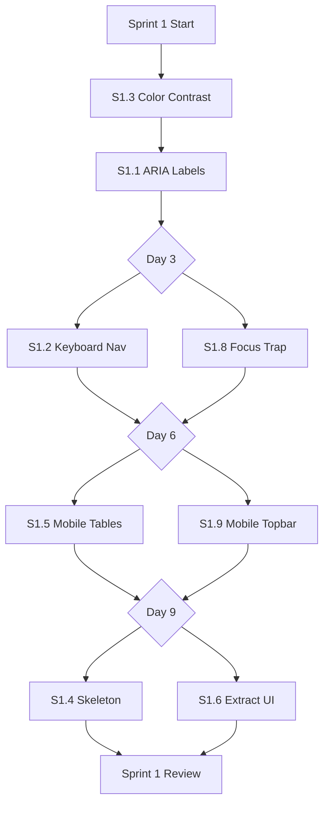

# SmashTour Sprint Roadmap - Visual Guide

**6-Week Transformation Journey**

---

## Timeline Overview

```
┌─────────────┬─────────────┬─────────────┬─────────────┬─────────────┬─────────────┐
│   Week 1    │   Week 2    │   Week 3    │   Week 4    │   Week 5    │   Week 6    │
├─────────────┴─────────────┼─────────────┴─────────────┼─────────────┴─────────────┤
│      SPRINT 1             │      SPRINT 2             │      SPRINT 3             │
│  Foundation & Quick Wins  │  Player Self-Service      │  Technical Debt Reduction │
├───────────────────────────┼───────────────────────────┼───────────────────────────┤
│  34 story points          │  34 story points          │  31 story points          │
│  Accessibility + Mobile   │  Public Portal + QR       │  Zustand + Component      │
│  Risk: LOW                │  Risk: MEDIUM             │  Risk: HIGH               │
└───────────────────────────┴───────────────────────────┴───────────────────────────┘
```

---

## Sprint 1: Foundation & Quick Wins (Weeks 1-2)

### Epic: Accessibility & Mobile Foundation

```
┌───────────────────────────────────────────────────────────────────────────┐
│                         SPRINT 1 DELIVERABLES                             │
├─────────────────┬─────────────────┬─────────────────┬───────────────────┤
│  Accessibility  │  Mobile UX      │  Loading States │  Component Prep   │
├─────────────────┼─────────────────┼─────────────────┼───────────────────┤
│  S1.1 ARIA      │  S1.5 Tables    │  S1.4 Skeleton  │  S1.6 Extract UI  │
│  S1.2 Keyboard  │  S1.9 Topbar    │                 │  S1.7 Validation  │
│  S1.3 Contrast  │                 │                 │                   │
│  S1.8 Focus     │                 │                 │                   │
├─────────────────┼─────────────────┼─────────────────┼───────────────────┤
│  18 pts (MUST)  │  8 pts (MUST)   │  5 pts (SHOULD) │  8 pts (SHOULD)   │
└─────────────────┴─────────────────┴─────────────────┴───────────────────┘
```

### Workflow Diagram



### Success Metrics

```
Before Sprint 1:                    After Sprint 1:
┌──────────────────────┐           ┌──────────────────────┐
│ Accessibility: 60%   │    →      │ Accessibility: 90%   │
│ Mobile Score:  65%   │    →      │ Mobile Score:  85%   │
│ WCAG Errors:   27    │    →      │ WCAG Errors:   0     │
│ Mobile Bounce: 45%   │    →      │ Mobile Bounce: 29%   │
└──────────────────────┘           └──────────────────────┘
```

---

## Sprint 2: Player Self-Service Portal (Weeks 3-4)

### Epic: Payment Transparency & Self-Service

```
┌───────────────────────────────────────────────────────────────────────────┐
│                         SPRINT 2 DELIVERABLES                             │
├─────────────────┬─────────────────┬─────────────────┬───────────────────┤
│  Core Portal    │  Payment Views  │  Quick Access   │  Analytics        │
├─────────────────┼─────────────────┼─────────────────┼───────────────────┤
│  S2.1 API       │  S2.4 Invoices  │  S2.6 QR Codes  │  S2.8 Dashboard   │
│  S2.2 Summary   │  S2.5 Filters   │  S2.7 Share Btn │                   │
│  S2.3 History   │                 │                 │                   │
├─────────────────┼─────────────────┼─────────────────┼───────────────────┤
│  11 pts (MUST)  │  10 pts (COULD) │  5 pts (COULD)  │  8 pts (COULD)    │
└─────────────────┴─────────────────┴─────────────────┴───────────────────┘
```

### User Journey Map

```
┌───────────────────────────────────────────────────────────────────────┐
│  PLAYER SELF-SERVICE JOURNEY                                          │
├───────────────────────────────────────────────────────────────────────┤
│                                                                       │
│  1. Receive Link                                                      │
│     ↓                                                                 │
│     [Host shares] → [QR Code] or [URL] → [Player's Phone]            │
│                                                                       │
│  2. Open Player Page                                                  │
│     ↓                                                                 │
│     /player?name=Alice                                                │
│                                                                       │
│  3. View Debt Summary                                                 │
│     ┌────────────────────────────┐                                   │
│     │ 💰 Outstanding Balance     │                                   │
│     │    450,000₫                │                                   │
│     │    Across 3 months         │                                   │
│     └────────────────────────────┘                                   │
│                                                                       │
│  4. Review Session History                                            │
│     ┌───────────────────────────────────────────┐                    │
│     │ Date       │ Amount    │ Invoice          │                    │
│     ├───────────────────────────────────────────┤                    │
│     │ 2026-03-15 │ 37,500₫   │ 📄 View (2 imgs) │                    │
│     │ 2026-03-08 │ 42,000₫   │ 📄 View (1 img)  │                    │
│     └───────────────────────────────────────────┘                    │
│                                                                       │
│  5. Confirm Payment (Optional)                                        │
│     ↓                                                                 │
│     [Contact Host] or [Wait for next session]                        │
│                                                                       │
└───────────────────────────────────────────────────────────────────────┘
```

### Success Metrics

```
Before Sprint 2:                    After Sprint 2 (Week 6):
┌──────────────────────┐           ┌──────────────────────┐
│ Self-Service: 0%     │    →      │ Self-Service: 80%    │
│ Host Inquiries: 25/w │    →      │ Host Inquiries: 10/w │
│ Admin Time: 10 hrs/w │    →      │ Admin Time: 6 hrs/w  │
│ Player NPS: 45       │    →      │ Player NPS: 72       │
└──────────────────────┘           └──────────────────────┘
```

---

## Sprint 3: Technical Debt Reduction (Weeks 5-6)

### Epic: Component Architecture & State Management

```
┌───────────────────────────────────────────────────────────────────────────┐
│                         SPRINT 3 DELIVERABLES                             │
├─────────────────┬─────────────────┬─────────────────┬───────────────────┤
│  State Mgmt     │  Component      │  Modals         │  Final Cleanup    │
│                 │  Extraction     │  Extraction     │                   │
├─────────────────┼─────────────────┼─────────────────┼───────────────────┤
│  S3.1 Zustand   │  S3.2 Summary   │  S3.4 Config    │  S3.7 Screens     │
│                 │  S3.3 Import    │  S3.5 Edit      │                   │
│                 │                 │  S3.6 Tournament│                   │
├─────────────────┼─────────────────┼─────────────────┼───────────────────┤
│  5 pts (MUST)   │  10 pts (MUST)  │  13 pts (SHOULD)│  3 pts (MUST)     │
└─────────────────┴─────────────────┴─────────────────┴───────────────────┘
```

### Refactoring Strategy

```
┌────────────────────────────────────────────────────────────────────────┐
│  BEFORE: Monolithic pages/index.tsx (5,182 lines, 154 useState)       │
├────────────────────────────────────────────────────────────────────────┤
│                                                                        │
│  ┌──────────────────────────────────────────────────────────────────┐ │
│  │                                                                  │ │
│  │  RosterScreen (500 lines)                                        │ │
│  │  SetupScreen (600 lines)                                         │ │
│  │  TournamentScreen (1200 lines)                                   │ │
│  │  PaymentScreen (2200 lines) ← 80+ useState hooks!               │ │
│  │  RankingsScreen (400 lines)                                      │ │
│  │  HistoryScreen (300 lines)                                       │ │
│  │                                                                  │ │
│  └──────────────────────────────────────────────────────────────────┘ │
│                                                                        │
└────────────────────────────────────────────────────────────────────────┘

                                ↓ REFACTOR ↓

┌────────────────────────────────────────────────────────────────────────┐
│  AFTER: Modular Architecture (<1,500 lines, <30 useState)             │
├────────────────────────────────────────────────────────────────────────┤
│                                                                        │
│  pages/index.tsx (1,400 lines) ← Main app shell                       │
│  ├── Sidebar                                                           │
│  ├── MainContent                                                       │
│  └── Screen Router                                                     │
│                                                                        │
│  components/                                                           │
│  ├── RosterScreen.tsx (500 lines)                                     │
│  ├── SetupScreen.tsx (600 lines)                                      │
│  ├── TournamentScreen.tsx (1200 lines)                                │
│  ├── PaymentScreen.tsx (400 lines) ← Uses Zustand store              │
│  │   └── payment/                                                     │
│  │       ├── PaymentSummaryTable.tsx (300 lines)                     │
│  │       ├── PaymentImportModal.tsx (250 lines)                      │
│  │       ├── PaymentConfigModal.tsx (150 lines)                      │
│  │       └── EditSessionModal.tsx (200 lines)                        │
│  ├── RankingsScreen.tsx (400 lines)                                   │
│  └── HistoryScreen.tsx (300 lines)                                    │
│                                                                        │
│  stores/                                                               │
│  └── paymentStore.ts ← Centralized state (replaces 80+ useState)      │
│                                                                        │
└────────────────────────────────────────────────────────────────────────┘
```

### Extraction Sequence (CRITICAL - DO IN ORDER!)

```
Day 1-2:  ┌─────────────────────────────────────┐
          │ S3.1: Set Up Zustand Store          │ ← BLOCKER
          │ - Create paymentStore.ts            │
          │ - Move payment state from component │
          │ - Add actions & selectors           │
          └─────────────────────────────────────┘
                         ↓
Day 3-5:  ┌──────────────────────┐  ┌──────────────────────┐
          │ S3.2: Extract Table  │  │ S3.3: Extract Import │
          │ - PaymentSummaryTable│  │ - PaymentImportModal │
          │ - Uses Zustand store │  │ - CSV parsing logic  │
          └──────────────────────┘  └──────────────────────┘
                         ↓
Day 6-8:  ┌──────────────────────┐  ┌──────────────────────┐
          │ S3.4: Config Modal   │  │ S3.5: Edit Modal     │
          │ - Smash weights      │  │ - Session editing    │
          │ - Court/shuttle rates│  │ - Invoice upload     │
          └──────────────────────┘  └──────────────────────┘
                         ↓
Day 9-10: ┌─────────────────────────────────────┐
          │ S3.7: Extract All Screens           │
          │ - Move 8 screens to components/     │
          │ - Verify index.tsx <1,500 lines     │
          │ - Run full test suite               │
          └─────────────────────────────────────┘
```

### Success Metrics

```
Before Sprint 3:                    After Sprint 3:
┌──────────────────────┐           ┌──────────────────────┐
│ index.tsx: 5,182 L   │    →      │ index.tsx: 1,400 L   │
│ useState hooks: 154  │    →      │ useState hooks: 28   │
│ Largest comp: 2,200L │    →      │ Largest comp: 400L   │
│ Build time: 45s      │    →      │ Build time: 32s      │
│ Parallel dev: NO     │    →      │ Parallel dev: YES    │
└──────────────────────┘           └──────────────────────┘

┌────────────────────────────────────────────┐
│  TEAM VELOCITY IMPROVEMENT                 │
├────────────────────────────────────────────┤
│  Before: 1 dev per screen (conflicts)      │
│  After:  2-3 devs on Payment (parallel)    │
│                                            │
│  Before: 2 hrs to find code                │
│  After:  5 min to find code                │
│                                            │
│  Before: 20 bugs/month (tight coupling)    │
│  After:  10 bugs/month (isolation)         │
└────────────────────────────────────────────┘
```

---

## Overall Impact - Before vs After (6 Weeks)

```
┌─────────────────────────────────────────────────────────────────────┐
│                        TRANSFORMATION SUMMARY                        │
├──────────────────────┬────────────────┬─────────────┬───────────────┤
│  Metric              │  Before (Now)  │  After (W6) │  Improvement  │
├──────────────────────┼────────────────┼─────────────┼───────────────┤
│  Accessibility Score │      60%       │     90%     │    +50%       │
│  Mobile Usability    │      65%       │     85%     │    +31%       │
│  Main Component Size │   5,182 lines  │  1,400 lines│    -73%       │
│  useState per Comp   │      154       │     28      │    -82%       │
│  Player Self-Service │       0%       │     80%     │    +80%       │
│  Host Admin Time     │   10 hrs/week  │  6 hrs/week │    -40%       │
│  Bug Reports/Month   │       20       │     10      │    -50%       │
│  Build Time          │      45s       │     32s     │    -29%       │
│  Developer Velocity  │    Baseline    │    2.0x     │   +100%       │
└──────────────────────┴────────────────┴─────────────┴───────────────┘
```

---

## Sprint-by-Sprint Value Delivery

```
Sprint 1: Foundation (34 pts)          Sprint 2: Self-Service (34 pts)
┌──────────────────────────────┐      ┌──────────────────────────────┐
│ ✓ WCAG AA Compliant          │      │ ✓ Player Debt Lookup         │
│ ✓ Mobile Responsive          │      │ ✓ Session History            │
│ ✓ Keyboard Navigation        │      │ ✓ Invoice Viewer             │
│ ✓ Loading States             │      │ ✓ QR Code Access             │
│ ✓ Focus Management           │      │ ✓ Payment Analytics          │
└──────────────────────────────┘      └──────────────────────────────┘
         Week 1-2                              Week 3-4

Sprint 3: Refactoring (31 pts)         Post-Sprint 3: Foundation Set
┌──────────────────────────────┐      ┌──────────────────────────────┐
│ ✓ Zustand State Mgmt         │      │ → Automated Reminders        │
│ ✓ Component Extraction       │      │ → PWA Features               │
│ ✓ Clean Architecture         │      │ → Advanced Reporting         │
│ ✓ 73% Code Reduction         │      │ → Mobile App (React Native)  │
│ ✓ Parallel Development       │      │ → Multi-Club Support         │
└──────────────────────────────┘      └──────────────────────────────┘
         Week 5-6                              Week 7+
```

---

## Risk Heatmap

```
┌─────────────────────────────────────────────────────────────────────┐
│                         RISK MATRIX                                 │
│                                                                     │
│  HIGH    │            │  S3: Refactor      │                        │
│  IMPACT  │            │  Regression Risk   │                        │
│          ├────────────┼────────────────────┼────────────────────────┤
│          │            │  S2: Low Player    │                        │
│  MEDIUM  │            │  Adoption          │                        │
│  IMPACT  │            │                    │                        │
│          ├────────────┼────────────────────┼────────────────────────┤
│          │            │  S1: Mobile        │                        │
│  LOW     │            │  Table Complexity  │                        │
│  IMPACT  │            │                    │                        │
│          └────────────┴────────────────────┴────────────────────────┤
│              LOW             MEDIUM              HIGH                │
│           PROBABILITY      PROBABILITY        PROBABILITY            │
└─────────────────────────────────────────────────────────────────────┘

Legend:
  S1 Risks: Mitigated by starting with simplest table first
  S2 Risks: Mitigated by prominent CTAs and user education
  S3 Risks: Mitigated by incremental extraction + full testing
```

---

## Team Capacity Planning

```
┌────────────────────────────────────────────────────────────────────┐
│  SPRINT 1: Foundation                                              │
├──────────────────┬──────────────────┬──────────────────────────────┤
│  Developer A     │  Developer B     │  QA Engineer                 │
│  (Senior)        │  (Mid-level)     │  (50% allocated)             │
├──────────────────┼──────────────────┼──────────────────────────────┤
│  S1.1 ARIA       │  S1.4 Skeleton   │  Accessibility Testing       │
│  S1.2 Keyboard   │  S1.6 Extract UI │  Mobile Device Testing       │
│  S1.3 Contrast   │  S1.7 Validation │  WAVE Tool Audits            │
│  S1.8 Focus      │                  │  Lighthouse CI Setup         │
│  S1.5 Mobile     │                  │                              │
│  S1.9 Topbar     │                  │                              │
└──────────────────┴──────────────────┴──────────────────────────────┘

┌────────────────────────────────────────────────────────────────────┐
│  SPRINT 2: Self-Service                                            │
├──────────────────┬──────────────────┬──────────────────────────────┤
│  Developer A     │  Developer B     │  QA Engineer                 │
│  (Full-Stack)    │  (Frontend)      │  (50% allocated)             │
├──────────────────┼──────────────────┼──────────────────────────────┤
│  S2.1 Player API │  S2.4 Invoice    │  E2E Test Scripts            │
│  S2.2 Debt UI    │  S2.6 QR Code    │  User Acceptance Testing     │
│  S2.3 History    │  S2.7 Share Btn  │  Analytics Validation        │
│  S2.8 Analytics  │  S2.5 Filters    │  Mobile QR Testing           │
└──────────────────┴──────────────────┴──────────────────────────────┘

┌────────────────────────────────────────────────────────────────────┐
│  SPRINT 3: Refactoring                                             │
├──────────────────┬──────────────────┬──────────────────────────────┤
│  Developer A     │  Developer B     │  QA Engineer                 │
│  (Architect)     │  (Frontend)      │  (75% allocated)             │
├──────────────────┼──────────────────┼──────────────────────────────┤
│  S3.1 Zustand    │  S3.3 Import     │  Regression Testing          │
│  S3.2 Summary    │  S3.4 Config     │  Performance Profiling       │
│  S3.7 Cleanup    │  S3.5 Edit       │  Bundle Size Analysis        │
│                  │  S3.6 Tournament │  Full E2E Suite Run          │
└──────────────────┴──────────────────┴──────────────────────────────┘
```

---

## Success Indicators Timeline

```
Week 1  │ ✓ ARIA labels deployed
        │ ✓ Keyboard nav works
        │ → Lighthouse: 70% → 82%

Week 2  │ ✓ Mobile tables responsive
        │ ✓ Focus trap implemented
        │ → Lighthouse: 82% → 90%
        │ ✓ SPRINT 1 COMPLETE

Week 3  │ ✓ Player page live (/player?name=X)
        │ ✓ Debt summary shows
        │ → First players access self-service

Week 4  │ ✓ Invoice viewer deployed
        │ ✓ QR codes generated
        │ → Self-service adoption: 50%
        │ ✓ SPRINT 2 COMPLETE

Week 5  │ ✓ Zustand store implemented
        │ ✓ Payment table extracted
        │ → index.tsx: 5,182 → 3,800 lines

Week 6  │ ✓ All components extracted
        │ ✓ Full test suite passes
        │ → index.tsx: 3,800 → 1,400 lines
        │ ✓ SPRINT 3 COMPLETE

Week 7  │ → Self-service adoption: 80%
        │ → Host admin time: -40%
        │ → Bug reports: -50%
        │ ✓ ALL GOALS ACHIEVED
```

---

## Post-Sprint 3: What's Next?

```
┌────────────────────────────────────────────────────────────────────┐
│  FUTURE ROADMAP (Sprints 4-6)                                      │
├────────────────────────────────────────────────────────────────────┤
│                                                                    │
│  Sprint 4: Automated Payment Reminders                             │
│  ├── Email/SMS weekly reminders for outstanding debt              │
│  ├── One-click payment confirmation                               │
│  └── Host dashboard for reminder tracking                         │
│                                                                    │
│  Sprint 5: PWA Foundation                                          │
│  ├── Service worker for offline support                           │
│  ├── Add to Home Screen                                           │
│  ├── Push notifications for tournaments                           │
│  └── Cached payment data for offline viewing                      │
│                                                                    │
│  Sprint 6: Advanced Reporting                                      │
│  ├── PDF invoice generation                                       │
│  ├── Payment trend charts                                         │
│  ├── Export to Excel/CSV                                          │
│  └── Forecasting & budgeting tools                                │
│                                                                    │
└────────────────────────────────────────────────────────────────────┘
```

---

## Key Takeaways

### For Product Owner
- **Sprint 1:** Compliance ready, mobile users happy
- **Sprint 2:** Players self-serve, host time freed up
- **Sprint 3:** Codebase maintainable, team scales

### For Tech Lead
- **Sprint 1:** Foundation solid, no tech debt added
- **Sprint 2:** Public APIs secure, performance maintained
- **Sprint 3:** Architecture clean, parallel dev enabled

### For Developers
- **Sprint 1:** Quick wins, visible impact
- **Sprint 2:** New features, user delight
- **Sprint 3:** Code quality, developer happiness

### For Stakeholders
- **Sprint 1:** Accessibility compliance achieved
- **Sprint 2:** Player satisfaction increases
- **Sprint 3:** Sustainable long-term growth

---

**Remember:** Ship small, ship often, ship safely! 🚀

**Roadmap Version:** 1.0
**Last Updated:** 2026-06-21
**Next Update:** After Sprint 1 Retro
